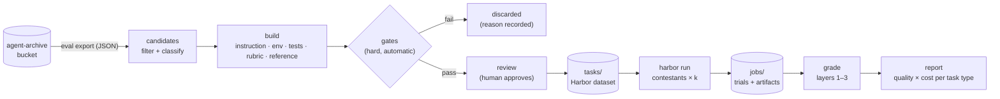

# agent-backtest — v0 plan

Status: planned 2026-09-30; nothing implemented. This is the first plan for
the project; later specs split out of it as pieces get built.

## Problem

There are now many coding-agent products and many models, and they are
priced very differently. The question a working engineer actually has is
narrow and personal:

> On the work *I* do, does Codex with GPT 6 Astra beat Claude Code with
> Opus 5.5? Is the cheaper model good enough for my refactors? Which
> product should I reach for on which kind of task?

Public leaderboards don't answer it. They measure models (not whole
products) on someone else's tasks, in someone else's harness, and a
70% score on a public set can be 30% on your codebase. Vendor comparisons
are one-off and decay as soon as either product ships a new release.

Meanwhile, anyone using [agent-archive](https://github.com/wangjohn/agent-archive)
already has the raw material for a better answer: a filtered, normalized
record of every Claude Code, Codex, and Cursor session they have run, in
their own bucket. Each session is a real task someone cared about, with the
prompts that described it, the corrections that steered it, and (often) the
change that eventually shipped.

agent-backtest turns those sessions into a **private benchmark** and
**backtests** agent products against it: rebuild the repo as it was when the
session started, give the same task to each contestant in a sandbox, grade
what each one produces, and report quality against cost per kind of task.

## Goals

1. **Compare agent products end to end.** A contestant is a whole setup
   (harness, harness version, model, reasoning effort, config), not a bare
   model.
2. **Tasks come from the user's own sessions.** Including work with no PR
   and no tests, which PR-mining tools cannot use.
3. **Grading people can trust**, in layers: deterministic checks first,
   rubric judging second, pairwise preference to break ties, with every
   grader tested against the known-good and known-bad answers before it is
   used.
4. **Honest results.** Confidence intervals, cost per *successful* task,
   and plain "not enough evidence to separate these" when that is the truth.
5. **Local-first and private.** Code, transcripts, and credentials never
   leave the user's machine or bucket, except to the model providers the
   user chose to benchmark.
6. **Usable by other people on their own archives**, not only by the
   author: high-precision task building with hard automatic gates, so a
   non-expert approving tasks can't approve a broken one.

## Non-goals (v0)

- A hosted service, a shared leaderboard, or any upload to us.
- Our own sandbox, agent runner, or agent adapters: [Harbor](https://docs.harborframework.com/)
  does that.
- Replacing public benchmarks, or claims about models in general. Results
  are about *this user's* work.
- Multi-turn replay with a simulated user. Planned for later (see
  [Later](#later)); v0 condenses each session into one upfront task.
- Model routing. The report recommends; it doesn't route.
- Capturing sessions. agent-archive does that; this tool only reads.

## Prior art and positioning

Checked 2026-09-30. Many tools build private benchmarks from **merged PRs
or git history**; few build them from **session transcripts**, and none
found is local, open source, cross-harness, and session-derived.

| Project | Source of tasks | Compares products? | Notes |
| --- | --- | --- | --- |
| [Tuneloop](https://tuneloop.io/) | Sessions + merged PRs | Claims to | Closest vision; hosted, early access. Its [OSS CLI](https://github.com/tuneloop/tuneloop) is analytics only. |
| [SWE-Together](https://arxiv.org/abs/2606.29957) (Meta) | Real user–agent sessions | No, models in one harness | Research benchmark. Best published method for session → task, including a simulated user and a rubric judge. Kept 0.97% of sessions. |
| [cline-bench](https://github.com/cline/cline-bench) | Cline sessions | No | Cline only, open-source repos only. |
| [Stet](https://www.stet.sh/) | Merged PRs | Yes | Tests as gate plus LLM judges; local CLI plus an account. |
| [Superconductor](https://www.superconductor.com/benchmark) | Merged PRs | Yes | Hosted. |
| [AgentHangar Evals](https://github.com/agenthangar/evals), [ab-eval](https://github.com/ABConvert/ab-eval), [RepoTrials](https://dev.to/repotrials/repotrials-turn-your-git-history-into-private-coding-agent-benchmarks-4462), [bakeoff](https://github.com/bakeoff-dev/bakeoff) | Git history / PRs / issues | Mostly yes | Early OSS tools; fail-to-pass validation. |
| [SWE-Factory](https://github.com/deepsoftwareanalytics/swe-factory), [RepoLaunch](https://github.com/microsoft/SWE-bench-Live) | Public GitHub issues | n/a | Automated environment building; worth borrowing from. |

What only session data gives us, and therefore what this project should be
good at:

1. **Tasks without a PR or tests**, including investigation and question
   sessions.
2. **Rubrics from the user's own corrections.** Every mid-session "no, don't
   change the public API" marks where a real agent went wrong and records
   what the user cares about.
3. **Intent.** The prompts say what was wanted; a diff only says what was
   done.
4. **(Later) a simulated user anchored to the real session**, so multi-turn
   behavior, where products differ most, can be compared.

What we reuse and do not build: the sandbox and agent runner (Harbor),
PR-mining conventions (fail-to-pass), and environment-building techniques
(SWE-Factory, RepoLaunch).

## Concepts

| Term | Meaning |
| --- | --- |
| **Session** | One archived agent-archive session. |
| **Candidate** | A session that passed selection and may become a task. |
| **Task** | A self-contained, replayable benchmark item: instruction, environment, graders, reference solution, provenance. Stored as a Harbor task directory. |
| **Contestant** | A whole agent setup: harness + harness version + model + reasoning effort + config (instruction files, skills, MCP servers). |
| **Trial** | One contestant attempting one task once. |
| **Run** | N contestants × M tasks × k attempts; one Harbor job (or several). |
| **Grade** | The layered score for one trial. Recomputable without re-running the trial. |
| **Report** | Aggregated grades, per task type, with cost and uncertainty. |

## Architecture



Division of labor:

- **agent-backtest (this repo, Python)** owns selection, building, gates,
  review, grading layers 2–3, and reporting. Its own code is deterministic;
  the parts that need judgment (writing instructions, Dockerfiles, tests,
  rubrics) are delegated to a coding agent (see [Builder](#builder)).
- **Harbor** owns sandboxes, running the contestants' real CLIs, the
  per-task verifier (grading layer 1), attempts, concurrency, and trajectory
  capture.
- **agent-archive** owns capture and the export format. It is a separate
  project with its own release cycle; we depend only on its documented
  export (see [Input contract](#input-contract-agent-archive)).

Why Harbor: it already runs `claude-code`, `codex`, and `cursor-cli` as
installed agents, in Docker locally or on many cloud sandboxes; it has an
oracle agent (runs the reference solution) and a nop agent, which give us
the grader self-test for free; its verifier supports multi-metric
`reward.json`; and it has a Python API as well as a CLI. It requires
Python ≥ 3.12, which sets ours.

## Input contract: agent-archive

agent-backtest reads sessions only through a documented, versioned export.
Three pieces of groundwork are being added to agent-archive for this
project (separate PRs there):

1. **Start and end commit.** HEAD SHA at session start, whether the tree
   was dirty, HEAD SHA at session end. Today only the branch name is
   recorded.
2. **Replay marking.** Sessions run *by* agent-backtest (contestants inside
   Harbor, the builder agent) are marked, hidden from the user's normal
   `list`, and never become `handoff --latest`. Their capture is still
   useful: tokens, tools, and transcripts in the same format as real
   sessions.
3. **An export command and JSON Schema** (working name
   `agent-archive eval export SESSION_ID`): harness and version, models,
   project name, branch, start/end SHAs, dirty flag, replay marker,
   timestamps, turn outcome, counts, tokens, files touched, tools used,
   explicit feedback, the ordered filtered human prompts, and the final
   response. Everything already filtered; nothing new leaves the machine.

agent-backtest pins a supported range of the export's `schema_version` and
runs contract tests in CI against a pinned agent-archive release. The
agent-archive spec is the source of truth; this section only says what we
need from it.

**Sessions without a start SHA** (captured before (1) shipped, or
backfilled): infer the start commit as the last commit on the recorded
branch before `started_at`, then confirm it by checking that the session's
first recorded edits apply cleanly. If they don't, the session is not a
candidate. This lets a new user get a benchmark from the history they
already have.

## Stage 1 — Candidates

Goal: from hundreds of sessions, a short list worth the cost of building.
Aim for **high precision, low recall**; discarding is cheap.

Deterministic filters (from metadata, no LLM):

- The session edited files and has a start commit (captured or inferred)
  in a git repo the user can check out.
- Not a replay session (the agent-archive marker).
- Parser status `complete` or `partial` (not `failed`).
- Not trivial: excludes sessions with only version bumps, lockfile or
  generated-file changes, or a single tiny edit.
- Optional user filters: project, harness, date range, minimum turns.

LLM classification (cheap model, one call per session, on the export only):

- **Task type:** bug fix, feature, refactor, test writing, migration,
  build/infra, docs, investigation/question.
- **Self-contained?** Rejects work that depends on external state
  (production data, a live service, a meeting, a ticket we can't see).
- **Difficulty estimate** and **whether it's discriminating:** trivial
  tasks that every contestant passes tell us nothing.
- **Outcome signal:** did the work land (end SHA reachable from the main
  branch, a later session didn't revert it), did the user correct the agent,
  was there explicit feedback.

Output: `candidates/<session-id>.json` with the export, the scores, and the
reason for each decision.

Sessions with many user corrections are *preferred*, not avoided: they are
where agents differ and they produce the best rubrics.

## Stage 2 — Build

Each candidate becomes a Harbor task directory. Build steps are resumable;
each writes its output to disk and can be re-run alone after a fix.

### Harbor task layout

```
tasks/<task-id>/
├── task.toml             # Harbor config + our provenance in [metadata]
├── instruction.md        # what the contestant sees
├── environment/
│   └── Dockerfile        # repo at the start commit, deps installed
├── solution/
│   └── solve.sh          # applies the shipped change (oracle)
├── tests/
│   ├── test.sh           # layer-1 grader; writes /logs/verifier/reward.json
│   └── ...               # hidden tests, copied in only at verify time
└── backtest/             # ours, not read by Harbor
    ├── rubric.json       # layer-2 checklist, fixed before any contestant runs
    ├── reference.diff    # the shipped change
    ├── source.json       # the export this task was built from
    └── gates.json        # gate results, see Stage 3
```

`task.toml` highlights:

- `[agent] network_mode = "allowlist"` with only the model API hosts the
  contestants need. No GitHub, no package registries during the attempt
  (dependencies are baked into the image). This is a leak control, not only
  a security one.
- `[verifier]` has no network: layer 1 is deterministic and offline.
- `[metadata]`: task type, source session ID, harness and model of the
  original session, start/end SHAs, build tool version, builder agent used.
- Timeouts sized from the original session's duration with a generous
  multiplier.

### The pieces

**Instruction.** Condense the session's prompts into what the user would
have written if they had known everything up front, *minus anything that
reveals the solution*. Include interface requirements that tests depend on
(new function names, CLI flags), as SWE-bench Pro does, so valid solutions
aren't failed for naming. A second model checks the instruction for leaks
against the reference diff.

**Environment.** One base image per repo (not per task), keyed by repo and
lockfile hash, then a thin per-task layer that checks out the start commit.
The Dockerfile must remove all git history and refs after the start commit
(agents have found fixes with `git log --all`), and must not contain
agent-archive, its config, or any transcript. The builder iterates
build → run the test suite at the start commit → fix, with a retry budget.
Repos needing services, secrets, GPUs, or macOS-only builds fail here, and
the user is told why.

**Hidden tests.** Use the shipped change's tests where they exist. Where
they don't, the builder writes them from the reference diff and the
instruction. Either way they must pass the fail-to-pass gate. Tests go
through public interfaces, not internals.

**Rubric.** A checklist of concrete, verifiable items, each with a weight:

- from the user's corrections in the transcript (the main source);
- from the reference diff (behavior that must exist);
- scope items (no changes to unrelated files, no public API changes unless
  asked, tests added when the change is testable).

Rubric items are written before any contestant runs and never edited after
seeing contestant output.

**Reference solution.** `solve.sh` applies `reference.diff`. For
investigation tasks with no diff, the reference is a checked list of key
facts from the original answer.

### Builder

The judgment-heavy steps are done by a coding agent, not by fixed code:
v0 invokes the user's own installed agent headless (`claude -p`,
`codex exec`) with prompts and templates from this repo. That reuses the
user's existing authentication, needs no extra API keys, and copes with the
long tail of repos better than a fixed pipeline.

Two safeguards:

- **Builder bias.** Tasks built entirely by one vendor's agent may favor
  that vendor's contestants. When both are installed, the other vendor's
  agent reviews each instruction and rubric. The report records which agent
  built each task.
- **Transcripts are data, not instructions.** A transcript can contain
  text written to mislead the next agent that reads it. The builder's
  prompt treats the export as quoted material, and the builder runs with
  the same sandboxing as contestants.

A later version may also ship the builder as an agent skill that
agent-archive's skill installer can offer.

## Stage 3 — Gates

Hard, automatic, and not overridable in review. A task failing any gate is
discarded with the reason recorded; the user can fix and rebuild.

| Gate | Check | Catches |
| --- | --- | --- |
| **Build** | Image builds; test suite runs at the start commit. | Broken environments. |
| **Oracle** | Harbor's `oracle` agent (reference solution) scores ≈ 1.0 on layer 1. | Tests or verifier that reject the real answer. |
| **Nop** | Harbor's `nop` agent (no change) scores ≈ 0. | Tests that don't test the change. |
| **Fail-to-pass** | Each hidden test fails at the start commit and passes with the reference. | Non-discriminating tests. |
| **Pass-to-pass** | Tests that passed at the start still pass with the reference. | Breaking the existing suite. |
| **Flakiness** | Oracle run 3× gives the same result. | Flaky tests. |
| **Leak check** | Instruction doesn't reveal the solution; the environment has no future history and no transcript. | Easy wins by cheating. |
| **Alternative solution** (v1) | A different agent solves the task; if its solution looks reasonable but fails, flag the tests as too specific. | Tests overfit to one implementation. |

## Stage 4 — Review

The user sees each surviving task on one page: the instruction, the
original prompts beside it, the rubric, the hidden tests, the gate results,
and the reference diff. They approve, reject (with a reason), or edit and
re-gate. v0 is a generated static HTML page plus CLI commands to record
decisions; nothing is served.

Review only asks what machines can't answer: *is this what I actually
asked for?* and *does the instruction give the answer away?*

## Stage 5 — Run

Contestants are declared in the workspace config, for example:

```toml
[[contestant]]
name = "claude-code-opus"
agent = "claude-code"          # Harbor installed-agent name
agent_version = "2.x.y"        # pinned; see open questions
model = "anthropic/claude-opus-5-5"
effort = "high"
config = "configs/claude"      # instruction files, settings, skills

[[contestant]]
name = "codex-gpt"
agent = "codex"
agent_version = "..."
model = "openai/gpt-6-astra"
effort = "high"
config = "configs/codex"
```

- Both harnesses get the same repo instructions (for example `AGENTS.md`
  and `CLAUDE.md` with identical content) so we don't measure how well each
  instruction file was written.
- Everything runs headless and fully automatic. No agent can ask the user a
  question; that is a known difference from real use until the simulated
  user exists.
- Credentials are forwarded by Harbor from the host environment
  (`ANTHROPIC_API_KEY` / `CLAUDE_CODE_OAUTH_TOKEN`, `OPENAI_API_KEY`,
  `CURSOR_API_KEY`). agent-backtest never stores them.
- **Before anything runs**: print trials (tasks × contestants × k), an
  estimated cost and wall time from the original sessions' token counts, and
  require confirmation. Default first run is small: about 10 tasks × 2
  contestants × 2 attempts.
- Each contestant's final `git diff` is saved as a trial artifact so
  layers 2–3 can grade without re-running.

## Stage 6 — Grade

**Layer 1 — deterministic (inside Harbor's verifier).** Build, lint and
typecheck where the repo has them, hidden tests, pass-to-pass tests.
`tests/test.sh` writes `reward.json` with separate metrics (for example
`hidden_tests`, `existing_tests`, `build`) and a `gate` value of 0 or 1.
A trial that fails the gate is not judged further.

**Layer 2 — rubric (agent-backtest, after the run).** A judge marks each
rubric item met or not met, citing diff lines as evidence. Optionally an
*agentic* judge runs inside the task's container and can execute code and
try edge cases. Judges come from at least two vendors; disagreements are
recorded.

**Layer 3 — pairwise (agent-backtest, after the run).** Among trials that
passed layer 1, blind comparisons of two diffs, both orders, several judges,
combined with a Bradley-Terry model. The question asked is "which would you
merge?"

Grading lives outside Harbor for layers 2–3 on purpose: judges can be
changed and trials re-graded without paying for new agent runs, and the
verifier stays offline and deterministic.

**Calibration.** `backtest calibrate` shows the user a blind sample of
pairs and measures agreement between the judges and the user. Low agreement
means fixing the rubric or judge prompt, not the scores.

**Grader self-test for layers 2–3.** The reference diff must score near the
top of the rubric, and the nop diff near the bottom, before the rubric is
used.

## Stage 7 — Report

- Per task type: success rate (pass@1), mean rubric score, pairwise
  ranking, **cost per successful task**, median wall time and turns.
- A quality-versus-cost chart per task type, with the best options at each
  price marked, not a single leaderboard.
- Bootstrap confidence intervals everywhere; with the small sets this tool
  produces, say "not enough evidence to separate these" when intervals
  overlap.
- Record contestant versions, task counts, builder agents, judge models,
  and the agent-backtest version in every report. Results are only valid
  for those versions.
- Output: a static HTML report and a JSON file.

Cost is reported at API list prices from token counts. Subscription plans
make real cost unknowable per task; the report says so.

## Workspace layout

A workspace is a directory the user creates with `backtest init`. It holds
private data and must never be pushed to a public remote.

```
my-benchmark/
├── backtest.toml     # sources, contestants, judges, defaults
├── candidates/       # stage 1 output
├── tasks/            # approved Harbor tasks (a Harbor dataset)
├── rejected/         # discarded tasks with reasons
├── jobs/             # Harbor jobs: trials, trajectories, artifacts
├── grades/           # layer 2–3 results
└── reports/          # HTML + JSON
```

## CLI (proposed)

| Command | Does |
| --- | --- |
| `backtest init` | Create a workspace and `backtest.toml`. |
| `backtest doctor` | Check Docker, Harbor, agent-archive, installed agent CLIs and credentials. |
| `backtest candidates` | Stage 1. |
| `backtest build [ID…]` | Stage 2, resumable. |
| `backtest check [ID…]` | Stage 3 gates. |
| `backtest review` | Stage 4 page and decisions. |
| `backtest run` | Stage 5, with the estimate and confirmation. |
| `backtest grade` | Layers 2–3 over a finished job. |
| `backtest calibrate` | Human agreement check for the judges. |
| `backtest report` | Stage 7. |

Every command is resumable, writes to the workspace, and has `--json`
output for scripting and for agents.

## Security and privacy

- **What leaves the machine:** task content (the user's code, the
  instruction) goes to the model providers of the contestants, builder, and
  judges the user configured. Nothing goes to this project. The user should
  check each provider's data retention terms before benchmarking private
  code; `doctor` says this once.
- **Autonomous agents run only in sandboxes**, never in the user's real
  checkout. Network is limited to model API hosts during attempts.
- **Credentials** are read from the environment at run time and never
  written to the workspace, tasks, or reports.
- **Transcript content is untrusted** (see [Builder](#builder)).
- **Workspaces contain private code.** `init` writes a `.gitignore` that
  excludes everything but `backtest.toml`, and warns if the workspace is
  inside a git repo with a public remote.

## Statistics

- Default k = 3 attempts per task per contestant for reporting; 2 for the
  first run.
- With about 50 tasks, differences under roughly 10 points are usually
  noise; the report states the interval rather than implying a winner.
- Task types with fewer than 5 tasks are shown but flagged as anecdotal.

## Expected yield

SWE-Together kept under 1% of sessions, with stricter filters than ours
(public, mature repos only). A user with 300 sessions may get only a
handful of tasks, which is the biggest risk to the tool being useful. The
tool must report yield honestly at each stage ("340 sessions → 41
candidates → 14 built → 9 passed gates") and treat improving yield without
lowering precision as a first-class goal.

## Milestones

**M0 — scaffold (this PR).** Package, CLI entry point, CI, release
workflow, docs structure, this plan.

**M1 — hand-built pilot.** About 10 tasks from agent-archive's own repo
(Go, self-contained tests), built mostly by hand in Harbor format with an
agent's help. Run 2 contestants × 3 attempts. Learn whether environment
building or grading is the real bottleneck, and confirm the Harbor details
in the open questions. No automation yet.

**M2 — input and candidates.** Read agent-archive's export; start-SHA
inference; stage 1 with the yield report.

**M3 — builder and gates.** Automate the steps M1 showed to be repetitive;
all Stage 3 gates.

**M4 — grading and report.** Layers 2–3, calibration, the HTML report.

**M5 — ready for other people.** Review page, `doctor`, cost estimate,
docs, supported-stacks list, first outside users on 2–3 different stacks.

## Later

- **Multi-turn replay with a simulated user** anchored to the real
  session's corrections, following SWE-Together. This is where products
  differ most and where session data is uniquely valuable.
- **Alternative-solution gate** (Stage 3, v1).
- **Opt-in sharing of results only** (task type, language, contestants,
  scores, cost; never code or transcripts) for an aggregate view across
  users. Only after the privacy design holds up.
- **Builder as an agent skill** installed alongside agent-archive's skills.
- **Other session sources** besides agent-archive (raw local transcripts).

## Open questions

1. **Pinning agent versions in Harbor.** Harbor's docs don't say how to pin
   `claude-code`, `codex`, or `cursor-cli` versions. Resolve in M1; may need
   a custom agent config or an upstream contribution.
2. **Trial artifacts.** Confirm how to reliably export the contestant's
   final diff (Harbor's `artifacts` setting, or a post-agent step).
3. **Harbor as a library or a subprocess.** The Python API exists but has
   no full reference. Start with the CLI (`harbor run -c config.yaml`) and a
   pinned version; move to the API if it proves stable.
4. **Subscription credentials.** Whether running many trials on
   subscription plans is allowed and practical, or whether API keys should
   be required.
5. **Cursor.** Headless `cursor-agent` inside containers is the least
   tested path; it may be v1.
6. **Instruction files.** Whether to use the user's real config or a stock
   config by default. Current plan: the user's, identical across harnesses.
7. **Investigation tasks.** Whether key-fact grading is reliable enough to
   include them in v0 or whether v0 is code-change tasks only.
8. **Agent installation versus the network allowlist.** Harbor's installed
   agents may download their CLI inside the container at setup time. Check
   whether setup happens before the agent's `network_mode` applies, or bake
   the CLIs into the base image instead.

## References

- Harbor docs: <https://docs.harborframework.com/>
- SWE-Together: <https://arxiv.org/abs/2606.29957>
- SWE-Factory: <https://github.com/deepsoftwareanalytics/swe-factory>
- RepoLaunch / SWE-bench-Live: <https://github.com/microsoft/SWE-bench-Live>
- cline-bench: <https://github.com/cline/cline-bench>
