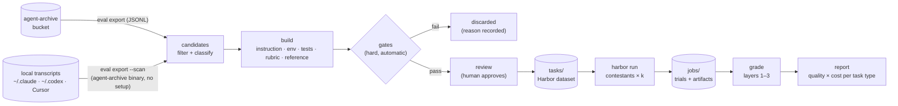

# agent-backtest — v0 plan

Status: planned 2026-09-30, revised the same day after review (grading,
statistics, and an M1 decision gate); nothing implemented. This is the
first plan for the project; later specs split out of it as pieces get
built.

## Problem

There are now many coding-agent products and many models, and they are
priced very differently. The question a working engineer actually has is
narrow and personal:

> On the work *I* do, does Codex with GPT 6 Astra beat Claude Code with
> Opus 5.5? Is the cheaper model good enough for my refactors? Did the
> new release, or my new `AGENTS.md`, make things better or worse?

Public leaderboards don't answer it. They measure models (not whole
products) on someone else's tasks, in someone else's harness, and a
70% score on a public set can be 30% on your codebase. Vendor comparisons
are one-off and decay as soon as either product ships a new release.

Meanwhile, anyone using a coding agent already has the raw material for a
better answer: the session transcripts Claude Code, Codex, and Cursor keep on
their machine, and, for anyone running
[agent-archive](https://github.com/wangjohn/agent-archive), a longer,
filtered, normalized record of every session across machines in their own
bucket. Each session is a real task someone cared about, with the prompts
that described it, the corrections that steered it, and (often) the change
that eventually shipped.

agent-backtest turns those sessions into a **private benchmark** and
**backtests** agent products against it: rebuild the repo as it was when the
session started, give the same task to each contestant in a sandbox, grade
what each one produces, and report quality against cost per kind of task.

The task set is the durable asset; any one report goes stale with the next
release. So the tool is built to be re-run: on each new model or harness
release, and on each change to the user's own setup (instruction files,
skills, MCP servers, effort level). Comparisons inside one product (a
cheaper model, a lower effort, a new config) are first-class, not a side
case: they are where gaps are large enough for a small benchmark to
detect (see [Statistics](#statistics)) and where the answer saves money.

## Goals

1. **Compare agent products end to end.** A contestant is a whole setup
   (harness, harness version, model, reasoning effort, config), not a bare
   model.
2. **Tasks come from the user's own sessions.** Including work that never
   became a PR, which PR-mining tools cannot use. v0 still needs a repo
   with a test suite that runs in a container; tasks in untested repos and
   investigation tasks come later (see [Open questions](#open-questions)).
3. **Grading people can trust**, in layers: deterministic checks first,
   rubric judging second, pairwise preference to break ties, with every
   grader tested against the known-good and known-bad answers before it is
   used.
4. **Honest results.** Paired comparisons with confidence intervals, cost
   per *successful* task, per-task evidence the user can read, and plain
   "not enough evidence to separate these" when that is the truth.
5. **Local-first and private.** Code, transcripts, and credentials never
   leave the user's machine or bucket, except to the model providers the
   user chose to benchmark.
6. **Usable by other people on their own sessions**, not only by the
   author: high-precision task building with hard automatic gates, so a
   non-expert approving tasks can't approve a broken one.
7. **Easy to try.** Works on the transcripts already on the machine, with
   only the agent-archive binary installed (no hooks, no bucket, no setup).
   A full agent-archive setup is an upgrade (longer history, several
   machines, recorded start commits), not a requirement.

## Non-goals (v0)

- A hosted service, a shared leaderboard, or any upload to us.
- Our own sandbox, agent runner, or agent adapters: [Harbor](https://docs.harborframework.com/)
  does that.
- Replacing public benchmarks, or claims about models in general. Results
  are about *this user's* work.
- Multi-turn replay with a simulated user. Planned for later (see
  [Later](#later)); v0 condenses each session into one upfront task.
- Model routing. The report recommends; it doesn't route.
- Capturing sessions. agent-archive does that; this tool only reads.

## Prior art and positioning

Checked 2026-09-30. Many tools build private benchmarks from **merged PRs
or git history**; few build them from **session transcripts**, and none
found is local, open source, cross-harness, and session-derived.

| Project | Source of tasks | Compares products? | Notes |
| --- | --- | --- | --- |
| [Tuneloop](https://tuneloop.io/) | Sessions + merged PRs | Claims to | Closest vision; hosted, early access. Its [OSS CLI](https://github.com/tuneloop/tuneloop) is analytics only. |
| [SWE-Together](https://arxiv.org/abs/2606.29957) (Meta) | Real user–agent sessions | No, models in one harness | Research benchmark. Best published method for session → task, including a simulated user and a rubric judge. Kept 0.97% of sessions. |
| [cline-bench](https://github.com/cline/cline-bench) | Cline sessions | No | Cline only, open-source repos only. |
| [Stet](https://www.stet.sh/) | Merged PRs | Yes | Tests as gate plus LLM judges; local CLI plus an account. |
| [Superconductor](https://www.superconductor.com/benchmark) | Merged PRs | Yes | Hosted. |
| [AgentHangar Evals](https://github.com/agenthangar/evals), [ab-eval](https://github.com/ABConvert/ab-eval), [RepoTrials](https://dev.to/repotrials/repotrials-turn-your-git-history-into-private-coding-agent-benchmarks-4462), [bakeoff](https://github.com/bakeoff-dev/bakeoff) | Git history / PRs / issues | Mostly yes | Early OSS tools; fail-to-pass validation. |
| [SWE-Factory](https://github.com/deepsoftwareanalytics/swe-factory), [RepoLaunch](https://github.com/microsoft/SWE-bench-Live) | Public GitHub issues | n/a | Automated environment building; worth borrowing from. |

What only session data gives us, and therefore what this project should be
good at:

1. **Tasks without a PR**: work committed straight to a branch, or never
   reviewed. (Tasks without tests, and investigation sessions, come later.)
2. **Rubrics from the user's own corrections.** Every mid-session "no, don't
   change the public API" marks where a real agent went wrong and records
   what the user cares about.
3. **Known-bad answers for free.** The agent's work just before each
   correction is a realistic wrong answer the user rejected. Graders must
   fail it, which is a far stronger self-test than "doing nothing fails".
4. **Intent.** The opening prompt says what was wanted, in the user's own
   words, written before the solution existed; a diff only says what was
   done.
5. **(Later) a simulated user anchored to the real session**, so multi-turn
   behavior, where products differ most, can be compared.

Merged PRs are the bigger, easier source of tasks, and every tool above
uses them. If session yield turns out too low (see
[Risks to the premise](#risks-to-the-premise)), the fallback is to add PRs
as a source and use sessions to enrich them (intent, corrections, known-bad
answers), not to abandon the pipeline.

What we reuse and do not build: the sandbox and agent runner (Harbor),
PR-mining conventions (fail-to-pass), and environment-building techniques
(SWE-Factory, RepoLaunch).

## Concepts

| Term | Meaning |
| --- | --- |
| **Session** | One coding-agent session, read either from the agent-archive bucket or from a transcript file on this machine (see [Session sources](#session-sources)). |
| **Candidate** | A session that passed selection and may become a task. |
| **Task** | A self-contained, replayable benchmark item: instruction, environment, graders, reference solution, provenance. Stored as a Harbor task directory. |
| **Contestant** | A whole agent setup: harness + harness version + model + reasoning effort + config (instruction files, skills, MCP servers). |
| **Trial** | One contestant attempting one task once. |
| **Run** | N contestants × M tasks × k attempts; one Harbor job (or several). |
| **Grade** | The layered score for one trial. Recomputable without re-running the trial. |
| **Report** | Aggregated grades, per task type, with cost and uncertainty. |

## Architecture



Division of labor:

- **agent-backtest (this repo, Python)** owns selection, building, gates,
  review, grading layers 2–3, and reporting. Its own code is deterministic;
  the parts that need judgment (writing instructions, Dockerfiles, tests,
  rubrics) are delegated to a coding agent (see [Builder](#builder)).
- **Harbor** owns sandboxes, running the contestants' real CLIs, the
  per-task verifier (grading layer 1), attempts, concurrency, and trajectory
  capture.
- **agent-archive** owns capture, transcript parsing, the privacy filter,
  and the export format, for both archived sessions and local transcript
  files. It is a separate project with its own release cycle; we depend only
  on its documented export (see [Session sources](#session-sources)).

Why Harbor: it already runs `claude-code`, `codex`, and `cursor-cli` as
installed agents, in Docker locally or on many cloud sandboxes; it has an
oracle agent (runs the reference solution) and a nop agent, which give us
the grader self-test for free; its verifier supports multi-metric
`reward.json`; and it has a Python API as well as a CLI. It requires
Python ≥ 3.12, which sets ours.

## Session sources

Two sources, **both read through the `agent-archive` binary**. agent-backtest
never parses native transcripts itself: agent-archive already has adapters
for all three harnesses, tracks their format changes, and applies the
privacy filter (credentials and injected instructions removed) before
anything reaches the builder or judge models. Parsing raw transcripts here
would duplicate that work and skip the filter.

| | **Archive** | **Local** |
| --- | --- | --- |
| Needs | agent-archive set up (hooks, bucket) | Only the `agent-archive` binary; no setup |
| Reads | The bucket: metadata sidecars and source bundles | Transcript files on this machine, the way `agent-archive handoff --file` already does |
| History | 90 days by default, every machine that syncs to the bucket | Whatever the apps keep locally (Claude Code deletes old transcripts after a period; see open questions), this machine only |
| Start commit | Recorded (once agent-archive ships it); inferred for older sessions | Always inferred |
| Explicit feedback | Yes (`agent-archive feedback`) | No |
| Replay marker | Recorded by the hook | Not recorded; excluded by working directory instead (see below) |

Both sources produce the same export records, so everything after this
stage is the same. When a session exists in both, the archive record wins.
The report states which source each task came from, and in local mode it
says what a full agent-archive setup would add (for example, "27 sessions
found on this machine; agent-archive keeps 90 days across machines").

### What agent-archive provides

These are being added to agent-archive for this project, as separate PRs
there. The agent-archive spec is the source of truth; this list only says
what we need.

1. **Start and end commit.** HEAD SHA at session start, whether the tree
   was dirty, HEAD SHA at session end. Today only the branch name is
   recorded.
2. **Replay marking.** Sessions run *by* agent-backtest are marked, hidden
   from the user's normal `list`, and never become `handoff --latest`.
3. **An export command and JSON Schema** (working name
   `agent-archive eval export`): harness and version, models, project name,
   branch, start/end SHAs, dirty flag, replay marker, timestamps, turn
   outcome, counts, tokens, files touched, tools used, explicit feedback,
   the ordered filtered human prompts, and the final response; in `full`
   detail, also the agent's file edits in order, each tied to the human
   turn it follows (for known-bad snapshots and to check the reference
   diff). Everything already filtered; nothing new leaves the machine.
4. **Local mode for the export.** `--file PATH --harness NAME` for one
   transcript, and `--scan` to discover transcripts on this machine, reusing
   the discovery `agent-archive backfill` already does (same `--harness`,
   `--project`, `--since`, `--until` filters). Like `handoff --file`, local
   mode needs no setup and never creates the data directory.
5. **Bulk export**, so the pipeline never spawns one process per session:
   - **JSON Lines on stdout**, one record per session, streamed as each
     finishes, each carrying its session ID and source.
   - **Two detail levels.** `--detail metadata` (identity, commits, counts,
     files touched, tools, outcome; no conversation text) is the cheap first
     pass. `--detail full` adds prompts and the final response, and is run
     only for sessions that survive the metadata filters.
   - **Selection by list.** `--ids-from -` reads session IDs or transcript
     paths from stdin, so the second pass exports exactly the survivors in
     one process.
   - **Bounded parallelism** inside agent-archive (a worker pool; parsing and
     filtering are the cost, not process start-up).
   - **Per-record errors.** A transcript that fails to parse becomes an
     error record on its own line; it never fails the batch.
   - For the archive source, the metadata pass reads sidecars only (as
     `list` does) and downloads source bundles only for the full pass.

agent-backtest pins a supported range of the export's `schema_version` and
runs contract tests in CI against a pinned agent-archive release.

### Caching

agent-backtest caches export records in the workspace, keyed by session ID
plus, for local files, path, size, and modification time, plus the
agent-archive version and the export's filter and parser versions. A re-run
only exports sessions that are new or changed. The cache lives in
agent-backtest, not agent-archive, so local mode stays setup-free.

### Excluding our own sessions

Contestants run inside Harbor's containers and never write to the user's
transcripts. The builder agent runs on the host, though (`claude -p`,
`codex exec`), so its sessions would appear in local history and could be
picked as candidates. The builder always runs from a working directory
under the workspace (and sets agent-archive's replay marker), and both
sources exclude sessions from those directories.

### Sessions without a start commit

All local sessions, and archived sessions captured before (1) shipped or
imported with `backfill`: infer the start commit as the last commit on the
recorded branch before `started_at`, then confirm it by checking that the
session's first recorded edits apply cleanly. If they don't, the session is
not a candidate. This lets a new user get a benchmark from the history they
already have.

## Stage 1 — Candidates

Goal: from hundreds of sessions, a short list worth the cost of building.
Aim for **high precision, low recall**; discarding is cheap.

Stage 1 runs in two passes so the expensive work is done only for sessions
that might survive: a bulk `--detail metadata` export feeds the
deterministic filters, then one bulk `--detail full` export of the
survivors feeds the LLM classification.

Deterministic filters (from metadata, no LLM):

- The session edited files and has a start commit (captured or inferred)
  in a git repo the user can check out.
- The tree was clean at the start (v0). A dirty start means the real
  starting state is uncommitted work we can't rebuild.
- The repo has a test suite (v0).
- Not a replay or builder session (the agent-archive marker, or a working
  directory under a workspace).
- Parser status `complete` or `partial` (not `failed`).
- Not trivial: excludes sessions with only version bumps, lockfile or
  generated-file changes, or a single tiny edit.
- Optional user filters: project, harness, date range, minimum turns.

LLM classification (cheap model, one call per session, on the export only):

- **Task type:** bug fix, feature, refactor, test writing, migration,
  build/infra, docs, investigation/question.
- **Self-contained?** Rejects work that depends on external state
  (production data, a live service, a meeting, a ticket we can't see).
- **Difficulty estimate** and **whether it's discriminating:** trivial
  tasks that every contestant passes tell us nothing.
- **Outcome signal:** did the work land (end SHA reachable from the main
  branch, a later session didn't revert it), did the user correct the agent,
  was there explicit feedback.
- **Opening prompt self-contained?** Whether the first prompt can stand as
  the instruction with small edits, or leans on context we don't have ("the
  bug we discussed", a screenshot).

Output: `candidates/<session-id>.json` with the export, the scores, and the
reason for each decision.

Sessions with many user corrections are *preferred*, not avoided: they are
where agents differ and they produce the best rubrics.

**Selection bias toward the incumbent.** Most users work mainly in one
product, so most tasks come from its sessions, and "the work landed"
favors tasks that product could finish. A benchmark of only those tasks
answers "is anything as good as what I use, on what it already does well",
which is biased toward staying put. So:

- Work that landed counts even when the agent failed and the user finished
  it by hand (the landed diff differs from the agent's edits). These are
  kept and marked; they are the tasks the incumbent couldn't do.
- Every task records its origin harness and model, and the report splits
  results by origin (see [Stage 7](#stage-7--report)).

## Stage 2 — Build

Each candidate becomes a Harbor task directory. Build steps are resumable;
each writes its output to disk and can be re-run alone after a fix.

### Harbor task layout

```
tasks/<task-id>/
├── task.toml             # Harbor config + our provenance in [metadata]
├── instruction.md        # what the contestant sees
├── environment/
│   └── Dockerfile        # repo at the start commit, deps installed
├── solution/
│   └── solve.sh          # applies the shipped change (oracle)
├── tests/
│   ├── test.sh           # layer-1 grader; writes /logs/verifier/reward.json
│   └── ...               # hidden tests, copied in only at verify time
└── backtest/             # ours, not read by Harbor
    ├── rubric.json       # layer-2 checklist, fixed before any contestant runs
    ├── reference.diff    # the shipped change
    ├── known-bad/        # pre-correction snapshots as diffs, see Rubric
    ├── source.json       # the export this task was built from
    └── gates.json        # gate results, see Stage 3
```

`task.toml` highlights:

- `[agent] network_mode = "allowlist"` with only the model API hosts the
  contestants need. No GitHub, no package registries during the attempt
  (dependencies are baked into the image). This is a leak control, not only
  a security one.
- `[verifier]` has no network: layer 1 is deterministic and offline.
- `[metadata]`: task type, source session ID, harness and model of the
  original session, start/end SHAs, build tool version, builder agent used.
- Timeouts and turn limits are the same for every contestant and set per
  task-size bucket, not from the original session's duration (which
  mostly measures the user's think time between turns). A trial that hits
  the limit is a failure and is counted separately in the report.

### The pieces

**Instruction.** Start from the session's opening prompt, edited as little
as possible: fill in context it leans on (a pasted error, "the file we
discussed"), and add the interface requirements the tests depend on (new
function names, CLI flags), as SWE-bench Pro does, so valid solutions
aren't failed for naming. The opening prompt is realistic, and it can't
leak the solution because it was written before the solution existed; a
rewrite by a model is neither. `instruction.md` records each edit against
the original. A second model checks the edits, not the whole text, for
leaks against the reference diff.

Each later correction in the session goes to exactly one place:

| The correction is… | Goes to | Example |
| --- | --- | --- |
| A requirement a user would reasonably state up front | The instruction | "It should also handle the `--dry-run` flag." |
| Something a good engineer should do unprompted | The rubric, hidden | "Don't mock the database in these tests." |
| A personal preference nobody could guess | The rubric, marked *taste*, reported separately | "We never use `assert` outside tests here." |
| About the original agent's own mistake | The rubric, as a known-bad check | "You deleted the migration, put it back." |

Putting a correction in the instruction removes it as a way to tell
contestants apart; leaving a taste correction unmarked penalizes
contestants for not reading the user's mind. The builder proposes the
split and review confirms it.

**Environment.** One base image per repo (not per task), keyed by repo and
lockfile hash, then a thin per-task layer that checks out the start commit.
The Dockerfile must remove all git history and refs after the start commit
(agents have found fixes with `git log --all`), and must not contain
agent-archive, its config, or any transcript. The builder iterates
build → run the test suite at the start commit → fix, with a retry budget.
Repos needing services, secrets, GPUs, or macOS-only builds fail here, and
the user is told why.

**Hidden tests.** Use the shipped change's tests where they exist. Where
they don't, the builder writes them from the instruction, using the
reference diff only to confirm them. Either way they must pass the
fail-to-pass gate. Tests go through public interfaces, not internals.
Builder-written tests are the ones most likely to be overfit to the
reference implementation, so each task records which kind it has, and the
report can show results with builder-written tests left out.

**Rubric.** A short checklist (aim for 3–8 items) of concrete, verifiable
items, each with a weight:

- from the user's corrections in the transcript (the main source), split
  as in the table above;
- scope items (no changes to unrelated files, no public API changes unless
  asked, tests added when the change is testable).

Behavior belongs in the hidden tests, not the rubric. Rubric items
copied from the reference diff reward matching one implementation, and
the reference was itself written by one product's agent.

Rubric items are written before any contestant runs and never edited after
seeing contestant output.

**Reference solution.** `solve.sh` applies `reference.diff`: the session's
own changes as they landed, taken from the commits between the start and
end SHAs that touch the session's files, cross-checked against the edits in
the transcript. Commits from other work in that range are left out; if
they can't be separated, the session is not a task. If the session left its
changes uncommitted, the reference is the first later commit on the branch
that contains them.

**Known-bad snapshots.** For each correction about the agent's own
mistake, the builder reconstructs the working tree just before that
correction from the transcript's edits and saves it as a diff in
`backtest/known-bad/`. These are used by the Known-bad gate.

### Builder

The judgment-heavy steps are done by a coding agent, not by fixed code:
v0 invokes the user's own installed agent headless (`claude -p`,
`codex exec`) with prompts and templates from this repo. That reuses the
user's existing authentication, needs no extra API keys, and copes with the
long tail of repos better than a fixed pipeline.

Two safeguards:

- **Builder bias.** Tasks built entirely by one vendor's agent may favor
  that vendor's contestants. When both are installed, the other vendor's
  agent reviews each instruction and rubric. The report records which agent
  built each task.
- **Transcripts are data, not instructions.** A transcript can contain
  text written to mislead the next agent that reads it. The builder's
  prompt treats the export as quoted material, and the builder runs with
  the same sandboxing as contestants.

A later version may also ship the builder as an agent skill that
agent-archive's skill installer can offer.

## Stage 3 — Gates

Hard, automatic, and not overridable in review. A task failing any gate is
discarded with the reason recorded; the user can fix and rebuild.

| Gate | Check | Catches |
| --- | --- | --- |
| **Build** | Image builds; test suite runs at the start commit. | Broken environments. |
| **Oracle** | Harbor's `oracle` agent (reference solution) scores ≈ 1.0 on layer 1. | Tests or verifier that reject the real answer. |
| **Nop** | Harbor's `nop` agent (no change) scores ≈ 0. | Tests that don't test the change. |
| **Fail-to-pass** | Each hidden test fails at the start commit and passes with the reference. | Non-discriminating tests. |
| **Pass-to-pass** | Tests that passed at the start still pass with the reference. | Breaking the existing suite. |
| **Flakiness** | Oracle run 3× gives the same result. | Flaky tests. |
| **Known-bad** | Each known-bad snapshot fails its rubric item (and the hidden tests, when the correction was about behavior). | A rubric or test that can't tell a real mistake from a fix. |
| **Leak check** | Instruction edits don't reveal the solution; the environment has no future history (other branches, tags, reflog, stash, remotes, packed refs) and no transcript. | Easy wins by cheating. |
| **Alternative solution** (v1) | A different agent solves the task; if its solution looks reasonable but fails, flag the tests as too specific. | Tests overfit to one implementation. |

**Post-run audit (v0).** The alternative-solution gate is expensive before
a run, but a run produces alternative solutions anyway. After each run,
before a task counts in a report:

- If every trial fails layer 1, the task goes back to review with the best
  contestant diffs (unlabeled) beside the tests: is it hard, or are the tests too
  specific? Overfit tasks are fixed or discarded, never silently scored.
- If every trial passes, the task is marked *non-discriminating*. It stays
  (it guards against regressions) but the report shows how many there are.

The audit judges the task only, never the contestants; its decisions are
recorded, and the same rule applies to every contestant.

## Stage 4 — Review

The user sees each surviving task on one page: the instruction, the
original prompts beside it, the rubric, the hidden tests, the gate results,
and the reference diff. They approve, reject (with a reason), or edit and
re-gate. v0 is a generated static HTML page plus CLI commands to record
decisions; nothing is served.

Review only asks what machines can't answer: *is this what I actually
asked for?*, *does the instruction give the answer away?*, and *is each
correction in the right place* (instruction, rubric, or taste)? The page
records how long each review took; human minutes per task is one of the
numbers M1 decides on.

## Stage 5 — Run

Contestants are declared in the workspace config, for example:

```toml
[[contestant]]
name = "claude-code-opus"
agent = "claude-code"          # Harbor installed-agent name
agent_version = "2.x.y"        # pinned; see open questions
model = "anthropic/claude-opus-5-5"
effort = "high"
config = "configs/claude"      # instruction files, settings, skills

[[contestant]]
name = "codex-gpt"
agent = "codex"
agent_version = "..."
model = "openai/gpt-6-astra"
effort = "high"
config = "configs/codex"
```

- Both harnesses get the same repo instructions (for example `AGENTS.md`
  and `CLAUDE.md` with identical content) so we don't measure how well each
  instruction file was written. Skills, MCP servers, and settings usually
  exist only for the user's main product; the report says when contestants
  ran with unequal setups ("your Claude Code setup vs stock Codex").
- Everything runs headless and fully automatic, each harness in its own
  no-prompt mode (a contestant that stalls on a permission prompt is a
  harness misconfiguration, not an agent failure). No agent can ask the
  user a question; that is a known difference from real use until the
  simulated user exists.
- **Infrastructure errors are not agent failures.** Container, network,
  rate-limit, and provider errors are recorded as such, retried up to a
  limit, and left out of scores; the report shows the error rate per
  contestant. A contestant with many errors gets a warning, not a low
  score. Unhandled, these are the most common way agent benchmarks report
  wrong winners.
- Credentials are forwarded by Harbor from the host environment
  (`ANTHROPIC_API_KEY` / `CLAUDE_CODE_OAUTH_TOKEN`, `OPENAI_API_KEY`,
  `CURSOR_API_KEY`). agent-backtest never stores them.
- **Before anything runs**: print trials (tasks × contestants × k), an
  estimated cost and wall time from the original sessions' token counts, and
  require confirmation. Default first run is small: about 10 tasks × 2
  contestants × 2 attempts.
- Each contestant's final `git diff` is saved as a trial artifact so
  layers 2–3 can grade without re-running.

## Stage 6 — Grade

**Layer 1 — deterministic (inside Harbor's verifier).** Build, lint and
typecheck where the repo has them, hidden tests, pass-to-pass tests.
`tests/test.sh` writes `reward.json` with separate metrics (for example
`hidden_tests`, `existing_tests`, `build`) and a `gate` value of 0 or 1.
A trial that fails the gate is not judged further.

**Layer 2 — rubric (agent-backtest, after the run).** A judge marks each
rubric item met or not met, citing diff lines as evidence. Optionally an
*agentic* judge runs inside the task's container and can execute code and
try edge cases. Judges come from at least two vendors; disagreements are
recorded.

**Layer 3 — pairwise (agent-backtest, after the run).** Among trials that
passed layer 1, blind comparisons of two diffs, both orders, several judges,
combined with a Bradley-Terry model. The question asked is "which would you
merge?"

Grading lives outside Harbor for layers 2–3 on purpose: judges can be
changed and trials re-graded without paying for new agent runs, and the
verifier stays offline and deterministic.

**Calibration.** `backtest calibrate` shows the user a blind sample of
pairs and measures agreement between the judges and the user. Low agreement
means fixing the rubric or judge prompt, not the scores.

**Grader self-test for layers 2–3.** The reference diff must score near the
top of the rubric, the nop diff near the bottom, and each known-bad
snapshot must fail the item its correction produced, before the rubric is
used. The same known-bad snapshots give the pairwise judge hard pairs
with a known answer (reference vs known-bad), which is the judge's
self-test.

Layer 3 is the most judge-heavy and the last to build. With few tasks it
may still be the most useful signal ("which would you merge?" is the
user's real question), so M1 checks whether it separates contestants that
layers 1–2 tie before it is kept.

## Stage 7 — Report

- **Head to head first.** For each pair of contestants: tasks won, lost,
  and tied, the paired difference with its interval, and a link from every
  task to both diffs. With small sets, the per-task table is the evidence
  the user will actually trust.
- Overall and per task group: success rate (pass@1, the mean over
  attempts), reliability (pass^k: every attempt succeeds), mean rubric
  score with *taste* items shown apart, pairwise ranking, **cost per
  successful task**, median wall time and turns, timeout and
  infrastructure-error rates.
- Task groups are coarse (for example: change behavior, restructure,
  tests/infra/docs) so each has enough tasks; the fine task type is kept
  as a filter.
- Results split by the task's origin harness, so a home-field advantage
  shows (see [Stage 1](#stage-1--candidates)).
- A quality-versus-cost chart, with the best options at each price marked,
  not a single leaderboard.
- For a cheaper contestant, the report answers the question the user is
  asking: "no more than X points worse, at Y% of the cost" (a
  non-inferiority bound), not only "not significantly different".
- Paired bootstrap intervals everywhere (see [Statistics](#statistics));
  say "not enough evidence to separate these" when the interval includes
  zero.
- Record contestant versions, task counts, builder agents, judge models,
  and the agent-backtest version in every report. Results are only valid
  for those versions.
- Output: a static HTML report and a JSON file.

Cost is reported at API list prices from token counts. Subscription plans
make real cost unknowable per task; the report says so.

## Workspace layout

A workspace is a directory the user creates with `backtest init`. It holds
private data and must never be pushed to a public remote.

```
my-benchmark/
├── backtest.toml     # sources, contestants, judges, defaults
├── .cache/           # export records, see Session sources
├── candidates/       # stage 1 output
├── tasks/            # approved Harbor tasks (a Harbor dataset)
├── rejected/         # discarded tasks with reasons
├── jobs/             # Harbor jobs: trials, trajectories, artifacts
├── grades/           # layer 2–3 results
└── reports/          # HTML + JSON
```

## CLI (proposed)

| Command | Does |
| --- | --- |
| `backtest init` | Create a workspace and `backtest.toml`. |
| `backtest doctor` | Check Docker, Harbor, agent-archive, installed agent CLIs and credentials. |
| `backtest candidates [--source archive\|local\|auto]` | Stage 1. `auto` (default) uses the archive when agent-archive is set up, plus local transcripts it hasn't captured. |
| `backtest build [ID…]` | Stage 2, resumable. |
| `backtest check [ID…]` | Stage 3 gates. |
| `backtest review` | Stage 4 page and decisions. |
| `backtest run` | Stage 5, with the estimate and confirmation. |
| `backtest grade` | Layers 2–3 over a finished job. |
| `backtest calibrate` | Human agreement check for the judges. |
| `backtest report` | Stage 7. |

Every command is resumable, writes to the workspace, and has `--json`
output for scripting and for agents.

## Security and privacy

- **What leaves the machine:** task content (the user's code, the
  instruction) goes to the model providers of the contestants, builder, and
  judges the user configured. Builder and judges also see the transcript's
  filtered prompts and edits (including known-bad snapshots, which are
  the user's code at an earlier state); contestants never do. Nothing goes to this project. The user should
  check each provider's data retention terms before benchmarking private
  code; `doctor` says this once.
- **Autonomous agents run only in sandboxes**, never in the user's real
  checkout. Network is limited to model API hosts during attempts.
- **Credentials** are read from the environment at run time and never
  written to the workspace, tasks, or reports.
- **Transcript content is untrusted** (see [Builder](#builder)).
- **Workspaces contain private code.** `init` writes a `.gitignore` that
  excludes everything but `backtest.toml`, and warns if the workspace is
  inside a git repo with a public remote.

## Statistics

- **The task is the unit, not the trial.** Every contestant runs the same
  tasks, so comparisons are paired: per task, the difference in mean score
  over attempts. Intervals come from a bootstrap over tasks, clustered by
  repo (tasks from one repo are not independent). Attempts reduce noise
  within a task; only more tasks narrow the interval between tasks.
- Default k = 3 attempts per task per contestant. k = 1 roughly doubles
  the tasks needed for the same interval; k above 3 helps little.
- **What a set this size can detect.** A simulation (task difficulty
  varying widely, contestants that disagree task by task, pass rates near
  50%, k = 3) gives roughly:

  | Tasks | 95% interval on the difference | Chance of detecting a 10-point gap | …a 20-point gap |
  | --- | --- | --- | --- |
  | 10 | ±23 points | ~15% | ~40% |
  | 25 | ±15 | ~30% | ~75% |
  | 50 | ±10 | ~45% | ~95% |
  | 100 | ±7 | ~75% | ~100% |

  Top products on the same kind of model are often within 10 points of
  each other, so at the yields in [Risks to the premise](#risks-to-the-premise)
  a vendor-versus-vendor comparison will usually end in "not enough
  evidence", and the report must say so plainly. Gaps between a frontier
  and a cheap model, between effort levels, or from a broken config are
  often 20 points or more, which 25 tasks can detect.
- `backtest run` shows the expected interval for the planned run before
  asking for confirmation, so the user can decide whether it is worth it.
- Task groups with fewer than 10 tasks are shown but marked anecdotal.
- The report never ranks contestants whose interval includes zero, and
  never adds up many per-group comparisons into a winner.

## Contamination

Private repos are the point of the tool and aren't in any model's training
data. Public repos can be: a contestant may have trained on the commit that
solved the task. Tasks from public repos whose end commit predates a
contestant model's training cutoff are marked, and the report shows results
with and without them. The M1 pilot repo (agent-archive) is public.

## Risks to the premise

These decide whether the tool is worth building past M1, so M1 measures
each one (see [Milestones](#milestones)).

1. **Yield.** SWE-Together kept under 1% of sessions, with stricter
   filters than ours (public, mature repos only). A user with 300 sessions
   may get only a handful of tasks. The tool must report yield honestly at
   each stage ("340 sessions → 41 candidates → 14 built → 9 passed
   gates"), and improving yield without lowering precision is a
   first-class goal. The fallback is adding merged PRs as a source (see
   [Prior art](#prior-art-and-positioning)).
2. **Power.** Even with good yield, a personal set is small (see
   [Statistics](#statistics)). If most reports say "can't tell", the tool
   is only useful for large gaps: cheaper models, effort levels, configs.
3. **Human cost per task.** Review, the correction split, and the post-run
   audit all need the user. If a good task takes much more than 10 minutes
   of the user's time, few people will build 25.
4. **Grader validity.** If the benchmark's winner disagrees with what the
   user sees reading the diffs, the graders are wrong, and no report on
   top of them is trustworthy.
5. **Staleness.** Products ship weekly. A report is valid for the versions
   it ran; the value is in re-running the same tasks cheaply, which is why
   the task set is the product.

## Milestones

**M0 — scaffold (this PR).** Package, CLI entry point, CI, release
workflow, docs structure, this plan.

**M1 — pilot and decision.** Time-boxed to about two weeks. No automation
beyond scripts. Two parts:

- **M1a — funnel.** Over the author's whole recent history (every repo,
  not only easy ones): run the Stage 1 filters and classification with
  throwaway scripts, then try to build environments for a random sample of
  about 20 candidates. Output: the real funnel, where sessions drop out,
  and human minutes per task. Cheap: no contestant runs.
- **M1b — pilot run.** About 25 tasks from at least 2 repos in different
  languages (agent-archive's Go repo is one), built by hand in Harbor
  format with an agent's help, known-bad snapshots included. Run 3
  contestants × 3 attempts, chosen to include one comparison with an
  expected large gap (same harness, frontier vs cheap model) and one
  vendor-versus-vendor. Grade layer 1 and layer 2; try layer 3 on the ties.
  Confirm the Harbor details in the open questions.

**Decision gate.** Continue to M2 only if all of these hold; otherwise
stop, or change the plan the way the failure points:

| Question | Continue if | If not |
| --- | --- | --- |
| Yield | The funnel projects at least 25 gated tasks from about 3 months of one heavy user's sessions. | Add merged PRs as the main source; sessions enrich them. |
| Human cost | Median of 10 minutes or less of user time per approved task. | Automate the costly step first, or narrow to the stacks where it's cheap. |
| Discrimination | At least a third of tasks separate the contestants, and the large-gap comparison is detected. | The tasks are too easy or too hard; fix selection before building more. |
| Grader validity | Reading the diffs blind, the author agrees with the graders' verdicts on at least 80% of a sample of 20 trials. | Fix graders before anything else. |
| Actionability | The result changes, or firmly confirms, which setup the author uses for some kind of task. | If it doesn't change the author's own choices, it won't change anyone's. |

The M1 results, and the decision, are written up in `docs/specs/` whatever
the outcome.

**M2 — sources and candidates.** Both session sources through
agent-archive's bulk export (archive and local), the export cache,
start-commit inference, and stage 1 with the yield report. Local mode is
the default path for someone trying the tool for the first time.

**M3 — builder and gates.** Automate the steps M1 showed to be repetitive;
all Stage 3 gates.

**M4 — grading and report.** Layers 2–3, calibration, the HTML report.

**M5 — ready for other people.** Review page, `doctor`, cost estimate,
docs, supported-stacks list, first outside users on 2–3 different stacks.

## Later

- **Multi-turn replay with a simulated user** anchored to the real
  session's corrections, following SWE-Together. This is where products
  differ most and where session data is uniquely valuable.
- **Alternative-solution gate** (Stage 3, v1).
- **Opt-in sharing of results only** (task type, language, contestants,
  scores, cost; never code or transcripts) for an aggregate view across
  users. Only after the privacy design holds up.
- **Builder as an agent skill** installed alongside agent-archive's skills.

## Open questions

1. **Pinning agent versions in Harbor.** Harbor's docs don't say how to pin
   `claude-code`, `codex`, or `cursor-cli` versions. Resolve in M1; may need
   a custom agent config or an upstream contribution.
2. **Trial artifacts.** Confirm how to reliably export the contestant's
   final diff (Harbor's `artifacts` setting, or a post-agent step).
3. **Harbor as a library or a subprocess.** The Python API exists but has
   no full reference. Start with the CLI (`harbor run -c config.yaml`) and a
   pinned version; move to the API if it proves stable.
4. **Subscription credentials.** Whether running many trials on
   subscription plans is allowed and practical, or whether API keys should
   be required.
5. **Cursor.** Headless `cursor-agent` inside containers is the least
   tested path; it may be v1.
6. **Instruction files.** Whether to use the user's real config or a stock
   config by default. Current plan: the user's, identical across harnesses.
7. **Investigation tasks and untested repos.** v0 is code-change tasks in
   repos with a test suite. Later: investigation tasks graded against a
   checked list of key facts from the original answer, and untested repos
   graded by builder-written tests plus rubric, once M1 shows how often
   builder-written tests are overfit.
8. **Local transcript retention.** How long each app keeps local
   transcripts by default (Claude Code removes old ones after a configurable
   period), so local mode can tell users how much history they can expect.
   Also check whether Codex's own session files record the commit, which
   would make inference unnecessary there.
9. **Agent installation versus the network allowlist.** Harbor's installed
   agents may download their CLI inside the container at setup time. Check
   whether setup happens before the agent's `network_mode` applies, or bake
   the CLIs into the base image instead.
10. **Merged PRs as a source.** Whether to add them in M2 regardless of
    M1's yield, joined to the sessions that produced them where possible.
    PR review comments are a team's version of mid-session corrections.
11. **Known-bad reconstruction.** How reliably the working tree before a
    correction can be rebuilt from the transcript's edits (tools that
    rewrite whole files, shell commands that edit files, edits the user
    made by hand between turns).

## References

- Harbor docs: <https://docs.harborframework.com/>
- SWE-Together: <https://arxiv.org/abs/2606.29957>
- SWE-Factory: <https://github.com/deepsoftwareanalytics/swe-factory>
- RepoLaunch / SWE-bench-Live: <https://github.com/microsoft/SWE-bench-Live>
- cline-bench: <https://github.com/cline/cline-bench>
